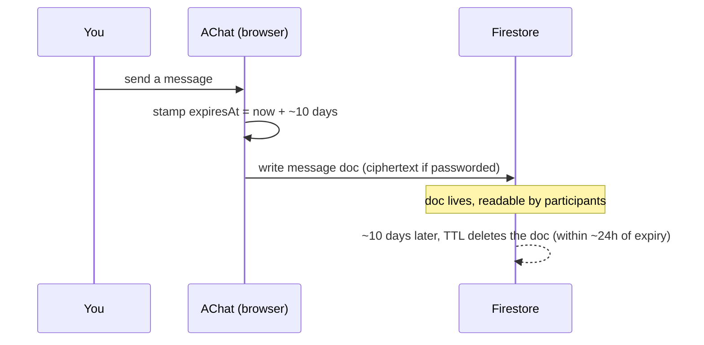

# How AChat works

**AChat is built around one idea: nothing is meant to last. Every chat, message, and file is written with an `expiresAt` timestamp set about 10 days in the future, and Firestore's TTL feature deletes them automatically once they expire.** There is no long-term archive by design.

## The moving parts

| Part | Role |
|---|---|
| **Browser app** | React app that does all encryption, rendering, and TTL stamping client-side. |
| **Firestore** | Stores chats, messages, files, reactions, presence, polls — each with an `expiresAt`. |
| **Firestore TTL policies** | Auto-delete expired documents (within ~24h of expiry). Free on the Spark plan. |
| **FilesHub** | Stores uploaded file bytes; cleaned up lazily on the client. |
| **Firebase Auth (optional)** | Only for users who sign in to reserve chats. |

There are **no server-side functions** and no paid backend — the app talks to Firestore and FilesHub directly, gated by security rules.

## The data model (simplified)

```
chats/{chatId}                     ← 8–20 char id; createdAt, expiresAt (TTL), hasPassword, salt?, verifier?
  messages/{msgId}                 ← createdAt, expiresAt (TTL), authorId, kind, body | {ciphertext, iv}
  files/{fileId}                   ← createdAt, expiresAt (TTL), fileshubId, metadata | {ciphertext, iv}
  reactions / presence / pins / polls   ← each with its own expiresAt TTL

users/{uid}                        ← optional accounts (NOT auto-deleted)
communities/{chatId}               ← public discovery index (NOT auto-deleted; messages inside still TTL)
```

Grouping/metadata fields (`kind`, `title`, `topic`, thread `threadParentId`/`replyCount`, reservation fields) stay **plaintext** even on passworded chats; only message bodies and file metadata are encrypted.

## The 10-day lifecycle



## What persists, and what doesn't

- **Ephemeral (auto-deleted):** chats, messages, files, reactions, presence, pins, polls.
- **Persistent (not auto-deleted):** optional user accounts, community discovery records, and any chat you explicitly [reserved](/features/keep-chats-and-accounts) (its `expiresAt` is simply pushed further out).

## Why this design

- **Privacy by expiry:** the less data that lingers, the less there is to leak.
- **No account friction:** the link is the room; identity is optional.
- **Free to run:** Firestore TTL + FilesHub keep it on free tiers with no server compute.

## Related

- [Security & encryption model](/concepts/security-and-encryption)
- [Data, privacy & deletion](/concepts/data-privacy-and-deletion)
