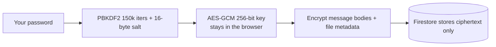

# Passwords & encryption

**Setting a password on an AChat room turns on true end-to-end encryption: AChat derives an AES-GCM key in your browser from your password and never sends the password or key to any server.** Encryption is optional and per-chat.

## How it works

When you set a password for a chat:

1. AChat generates a random 16-byte **salt** stored on the chat document.
2. Your password + salt are run through **PBKDF2** (150,000 iterations, SHA-256) to derive a 256-bit **AES-GCM** key, using the browser's built-in Web Crypto API. No external library, no network call.
3. A small **verifier** (`AES-GCM`-encrypting a known constant) is stored on the chat doc so a returning participant can confirm they typed the correct password *without the server ever checking it*.
4. From then on, message bodies and file metadata are stored as `{ ciphertext, iv }` — opaque to the server and to anyone without the password.

The key is held only in memory for the session and is never persisted. There is an optional "remember password" convenience for the current device, scoped locally.

## What encryption protects

- **Message text** of passworded chats — stored as ciphertext.
- **File metadata** (the file name and the FilesHub URL) of passworded chats — stored as ciphertext.

## What it does *not* protect (honest framing)

- **File bytes are not encrypted at rest.** The file contents uploaded to FilesHub are not encrypted; only the URL/metadata pointing at them is (on passworded chats). Treat shared files accordingly.
- **Grouping/metadata fields stay plaintext** even on passworded chats — for example a chat's `kind`/`title`/`topic`, thread `replyCount`, and reservation fields. Only message bodies and file metadata are encrypted.
- **Open chats are plaintext.** No password means no encryption: anyone with the ID reads everything.
- **No password recovery.** Lose the password and the chat is unrecoverable — there is no reset and no backdoor, by design.
- **Infrastructure telemetry still applies.** IP and user agent are processed by Firebase regardless of encryption.

## Best practices

- Share the password over a **separate trusted channel** — never inside the chat itself.
- Use a **strong, unique** password; PBKDF2 slows brute force but cannot save a weak password.
- Prefer a **generated chat ID** with a password for anything sensitive.

## Related

- [Security & encryption model](/concepts/security-and-encryption) — the full threat model.
- [Data, privacy & deletion](/concepts/data-privacy-and-deletion)
