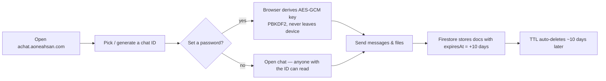

# Introduction

**AChat (Anonymous Chat AI) is a no-signup, transient chat app: you pick or generate a chat ID, share the link, and talk — and every message and file auto-deletes about 10 days after it is sent.** An optional password turns on true end-to-end encryption performed entirely in your browser. There is no registration, no email, and no phone number; opening the link puts you in the room.

The web app lives at [achat.aoneahsan.com](https://achat.aoneahsan.com), is free to use, and is built and maintained by [Ahsan Mahmood](https://aoneahsan.com). An Android build is available on [Google Play](https://play.google.com/store/apps/details?id=com.aoneahsan.achatachat).

## What it does

| Capability | One-line summary |
|---|---|
| **Anonymous rooms** | Pick or generate a chat ID (8–20 characters), share the URL, and start talking. No account. |
| **Optional E2E encryption** | Set a password and AChat derives an AES-GCM key in your browser with PBKDF2. Message bodies and file metadata are encrypted client-side. |
| **File sharing** | Send files up to 10 MB each, 100 MB total per chat, with image previews and a lightbox. |
| **Threads & replies** | Quote a message or branch a threaded conversation off any message. |
| **Groups & communities** | Named private group chats, plus public, discoverable communities with best-effort client-side moderation. |
| **Embeddable widget** | Drop a sandboxed chat into any website as an inline iframe or a floating launcher. |
| **10-day auto-delete** | Firestore TTL removes messages and files about 10 days after they are sent, with lazy file cleanup. |

## Who it is for

- **Anyone who wants a throwaway chat link** — support handoffs, quick coordination, one-off conversations you do not want to keep.
- **Privacy-minded users** who want client-side encryption without installing anything or trusting a server with their key.
- **Site owners** who want to embed a lightweight, anonymous chat widget without standing up their own backend.
- **Communities** that want an open, anonymous, ephemeral public room rather than a permanent, account-gated forum.

## What it is *not*

Honesty matters more than marketing. Some explicit non-claims:

- **It has no AI chatbot.** Despite the brand name "Anonymous Chat AI", AChat does **not** include any AI or LLM chat feature — conversations are between real people. The name is historical branding; the accurate description is "anonymous, ephemeral, optionally end-to-end-encrypted chat". See the [FAQ](/faq#does-achat-use-ai).
- **Open chats are not private.** A chat without a password is readable by anyone who has the chat ID. Privacy comes from the optional password, not from secrecy of the link alone.
- **File bytes are not encrypted at rest.** On passworded chats only the file URL/metadata is encrypted; the file contents on FilesHub are not. See [Security & encryption](/concepts/security-and-encryption).
- **It is not anonymous against legal process.** Standard infrastructure telemetry (IP address, user agent) is processed by Firebase. AChat hides your identity from other participants, not from a court order.
- **Deletion is "about 10 days", not instant or guaranteed-to-the-minute.** Firestore TTL typically removes expired documents within ~24 hours of expiry; FilesHub cleanup is lazy.

## How it works in 60 seconds

Read on with the [Quick Start](/getting-started/quick-start), or jump to [How AChat works](/concepts/how-it-works) for the data model.
